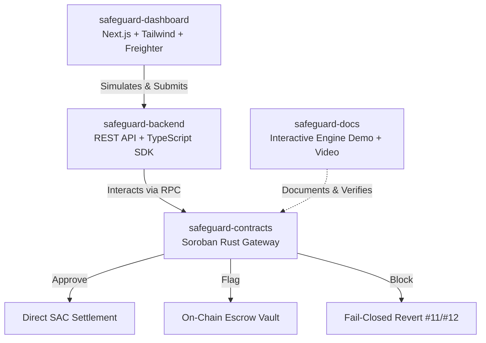

# Safeguard Pay

**Non-custodial, policy-guarded payment gateway and deterministic compliance engine for Soroban on Stellar.**

Safeguard provides an on-chain firewall for Web3 payments, payroll disbursals, and merchant settlements in SEP-41 SAC tokens (USDC, EURC, XLM). Every transaction is evaluated deterministically against policy rules before tokens move.

---

## 🏛️ The 4-Tier Architecture

Safeguard is structured across four dedicated, production-ready repositories covering smart contracts, backend integration, frontend operator console, and developer documentation:

| Repository | Role | Tech Stack | Repository Link |
| :--- | :--- | :--- | :--- |
| **`safeguard-contracts`** | **Smart Contracts** | Rust, Soroban SDK, Protocol 22+ | [Safeguard-Inc/safeguard-contracts](https://github.com/Safeguard-Inc/safeguard-contracts) |
| **`safeguard-backend`** | **Integration & SDK** | TypeScript, Node.js, Stellar SDK | [Safeguard-Inc/safeguard-backend](https://github.com/Safeguard-Inc/safeguard-backend) |
| **`safeguard-dashboard`** | **Frontend Console** | Next.js 14, Tailwind, Freighter | [Safeguard-Inc/safeguard-dashboard](https://github.com/Safeguard-Inc/safeguard-dashboard) |
| **`safeguard-docs`** | **Docs Hub & Demo** | Static HTML5/ESM, Pitch Video | [Safeguard-Inc/safeguard-docs](https://github.com/Safeguard-Inc/safeguard-docs) |

---

## 🌐 Live Deployments & Pitch Video

* **Live Web Console & Checkout Demo:** [https://safeguard-dashboard-mocha.vercel.app](https://safeguard-dashboard-mocha.vercel.app)
* **Documentation & Interactive Demo:** [https://safeguard-docs.vercel.app](https://safeguard-docs.vercel.app)
* **Pitch Video (5 Minutes, Full Stack):** [https://safeguard-docs.vercel.app/assets/video/safeguard-pitch.mp4](https://safeguard-docs.vercel.app/assets/video/safeguard-pitch.mp4)
* **Safeguard Payments Contract (Testnet):** `CBLQLJAG72M4XQRJMQHSKYIFVHQD7LNTNOQH2GRMCMBWMSLBSLTGTJC7`
* **Safeguard Policy Engine (Testnet):** `CDVME6OPYZO6RAIWRFKLI3ACZHPNZK7GDBIX7YSIER3QLA2SO47QX5IB`

---

## 🌊 Contributing & Stellar Drips Wave Sprints

Safeguard participates in the **Stellar Drips Wave** contributor sprints organized by the Drips Network in partnership with the Stellar Development Foundation (SDF).

We have 25+ scoped, contributor-ready backlog issues across our repositories:
* **[Smart Contract Issues](https://github.com/Safeguard-Inc/safeguard-contracts/issues)** (Rust / Soroban)
* **[Backend & SDK Issues](https://github.com/Safeguard-Inc/safeguard-backend/issues)** (TypeScript / Node.js)
* **[Frontend Issues](https://github.com/Safeguard-Inc/safeguard-dashboard/issues)** (React / Next.js)

All Wave issues carry complexity tags (`complexity: trivial`, `complexity: small`, `complexity: medium`, `complexity: large`) and explicit acceptance test criteria. Point rewards are paid out in USDC on Stellar at the conclusion of each sprint.

---

## 📜 License

All repositories are open source under the [Apache-2.0 License](LICENSE).
