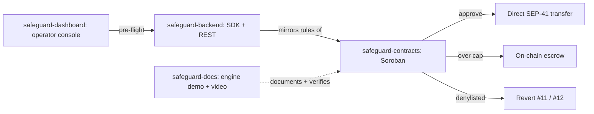

# Safeguard

**Policy-guarded payments on Stellar.** Each payment either settles directly,
goes into on-chain escrow for review, or is rejected before any tokens move.

## Why

Teams paying out stablecoins on Stellar for payroll, merchant settlement or
treasury operations need controls *before* money moves. Safeguard puts those
controls in a Soroban contract instead of an off-chain service that can be
bypassed:

- **Denylisted party:** the transaction reverts and nothing moves.
- **Over the spend cap:** the funds go into contract escrow, for admin release
  or a timelocked refund.
- **Everything else:** the payment settles directly in the same transaction.

## Architecture

| Repository | Role | Stack |
| :--- | :--- | :--- |
| [**safeguard-contracts**](https://github.com/Safeguard-Inc/safeguard-contracts) | Payments gateway, escrow, policy registry | Rust, Soroban SDK |
| [**safeguard-backend**](https://github.com/Safeguard-Inc/safeguard-backend) | TypeScript SDK and REST API | TypeScript, Express |
| [**safeguard-dashboard**](https://github.com/Safeguard-Inc/safeguard-dashboard) | Operator console | Next.js 14, Tailwind |
| [**safeguard-docs**](https://github.com/Safeguard-Inc/safeguard-docs) | Docs, engine demo, pitch video | Static HTML/ESM |

## Live on Stellar Testnet

| | |
| :--- | :--- |
| **SafeguardPayments** | [`CDC6KVX7QT7CD3GOVGX44NQUNS7FMSZKIAXTV3TDGSXQKJRQMDZRSRCN`](https://stellar.expert/explorer/testnet/contract/CDC6KVX7QT7CD3GOVGX44NQUNS7FMSZKIAXTV3TDGSXQKJRQMDZRSRCN) |
| **SafeguardPolicy** | [`CCXFDOLLLFZKAG7X6AKN2YLKET5F5X565IHZXPOAGCM7W6MJG5WKANLN`](https://stellar.expert/explorer/testnet/contract/CCXFDOLLLFZKAG7X6AKN2YLKET5F5X565IHZXPOAGCM7W6MJG5WKANLN) |
| Approved payment | [19,237 stroops](https://stellar.expert/explorer/testnet/tx/c762b42f818387aa584ea33d3da006f22671071ed6e182068994ea6597395e6c) (~0.002 XLM) |
| Escrowed payment | [proof tx](https://stellar.expert/explorer/testnet/tx/2d83231685f03b17e1a001e6c82c38453459b4f67b416ef60f9be73133026f0e) → [released](https://stellar.expert/explorer/testnet/tx/f1257dd8e902c4dad2c00b8f71cc98999d9885e402fbd7959c4242202cef2331) |

**Links:** [Console](https://safeguard-dashboard-mocha.vercel.app) ·
[Docs](https://safeguard-docs.vercel.app) ·
[Pitch video](https://safeguard-docs.vercel.app/assets/video/safeguard-pitch.mp4)

## Contribute: Stellar Drips Wave

Safeguard takes part in the **Stellar Drips Wave**. Each repository's README
has a roadmap, and every roadmap item becomes a scoped issue with acceptance
criteria and a complexity label:

- [Contract issues](https://github.com/Safeguard-Inc/safeguard-contracts/issues) (Rust / Soroban)
- [Backend & SDK issues](https://github.com/Safeguard-Inc/safeguard-backend/issues) (TypeScript)
- [Dashboard issues](https://github.com/Safeguard-Inc/safeguard-dashboard/issues) (React / Next.js)
- [Docs issues](https://github.com/Safeguard-Inc/safeguard-docs/issues)

All repositories are open source under Apache-2.0.
